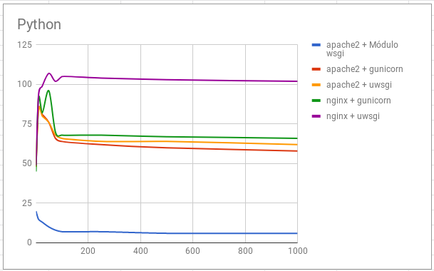

# Ejecución de scripts PHP y Python. Rendimiento

## Ejecución de scripts PHP

Vamos a comparar el rendimiento de distintas configuraciones de servidores web sirviendo páginas dinámicas programadas con PHP, en concreto vamos a servir un CMS Wordpress.

Las configuraciones que vamos a realizar son las siguientes:

* Módulo php5-apache2
* PHP-FPM (socket unix) + apache2
* PHP-FPM (socket TCP) + apache2
* PHP-FPM (socket unix) + nginx
* PHP-FPM (socket TCP) + nginx

### Tarea 1

#### Apache2 y mod_php

* Realiza las configuraciones indicadas anteriormente y muestra una comprobación (con phpinfo()) donde se vea la configuración actual.



* Explica brevemente la modificación en los ficheros de configuración para cada una de las opciones.

Instalamos el módulo.

* En cada una de las configuraciones debe funcionar el CMS WordPress.

* Cuando accedes a la biblioteca de medios de WordPress para subir una imagen, vemos que el tamaño máximo es 512Mb:



Modifica en la configuración de PHP en cada caso para aumentar el tamaño de los ficheros que podemos subir.

Modificamos la capacidad del post
~~~
post_max_size = 800M
~~~

Y ahora ya podemos subir el tamaño maximo

~~~
upload_max_filesize = 700M
~~~



* Realiza varias pruebas (al menos 5) de rendimiento sobre cada configuración y quedáte con una media de las peticiones respondidas por segundo. ¿Qué configuración responde más peticiones por segundo?. Vamos a realizar pruebas con 200 peticiones concurrentes:

~~~
sudo apt install apache2-utils 
~~~

~~~
ab -t 10 -c 200 -k http://172.22.7.242/index.php
~~~

~~~
Requests per second:    49.97 [#/sec] (mean)
Requests per second:    75.69 [#/sec] (mean)
Requests per second:    84.21 [#/sec] (mean)
Requests per second:    81.54 [#/sec] (mean)
Requests per second:    72.83 [#/sec] (mean)
~~~

La media sale a 75,85

#### Rendimiento
Después de hacer varias pruebas de rendimiento con un número variable de peticiones concurrentes (1, 10, 25, 50, 75, 100, 250, 500, 1000). Los resultados obtenidos son los siguientes:



Podemos determinar que la opción que nos ofrece más rendimiento es nginx + fpm_php (socket unix).

A partir de esa configuración vamos a intentar aumentar el rendimiento de nuestro servidor.

## Aumento de rendimiento en la ejecución de scripts PHP

### Tarea 2 

Añade a la configuración ganadora del punto anterior memcached. Documenta la instalación y configuración memcached. Recuerda que para que Wordpress utilice memcached le tenemos que instalar un plugin. Muestra las estadísticas de memcached después de acceder varias veces a wordpress para comprobar que esa funcionando.

### Tarea 3 

Configura un proxy inverso - caché Varnish escuchando en el puerto 80 y que se comunica con el servidor web por el puerto 8080. Entrega y muestra una comprobación de que varnish está funcionando con la nueva configuración.

#### Rendimiento
Veamos las tres opciones que hemos configurado y veamos los resultados después del estudio de rendimiento:



Podemos observar como el uso de varnishd aumenta muy significativamente el rendimiento de nuestro servidor.

## Ejecución de scripts Python

Vamos a comparar el rendimiento de distintas configuraciones de servidores web sirviendo páginas dinámicas programadas con Python, en concreto vamos a servir un CMS Mezzanine (Instala algunas páginas de demostración durante la instalación: `Would you like to install some initial demo pages?`).

Las configuraciones que vamos a realizar son las siguientes:

* apache2 + Módulo wsgi
* apache2 + gunicorn
* apache2 + uwsgi
* nginx + gunicorn
* nginx + uwsgi

### Tarea 4 

Documenta la instalación y configuración para cada una de las configuraciones propuestas en el ejercicio. En cada una de las configuraciones debe ejecutarse un CMS python, por ejemplo, Mezzanine.

#### Rendimiento



Podemos observar que la opción que más rendimiento ofrece es nginx + uwsgi.