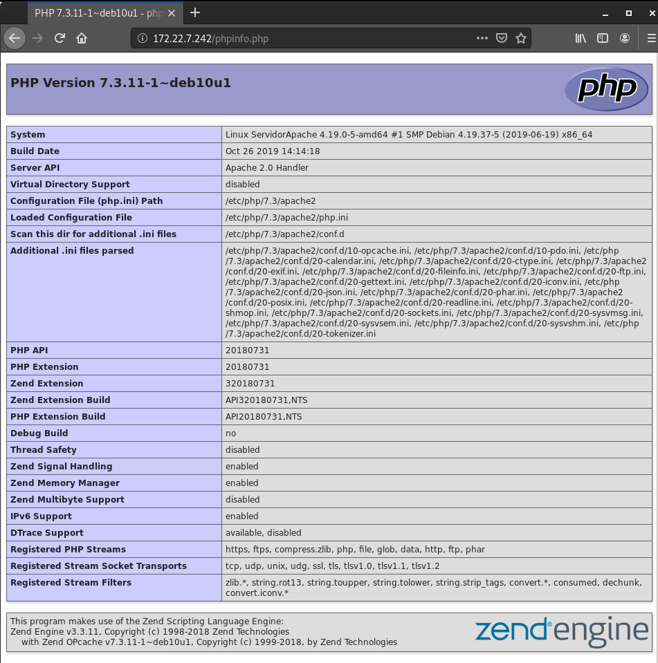
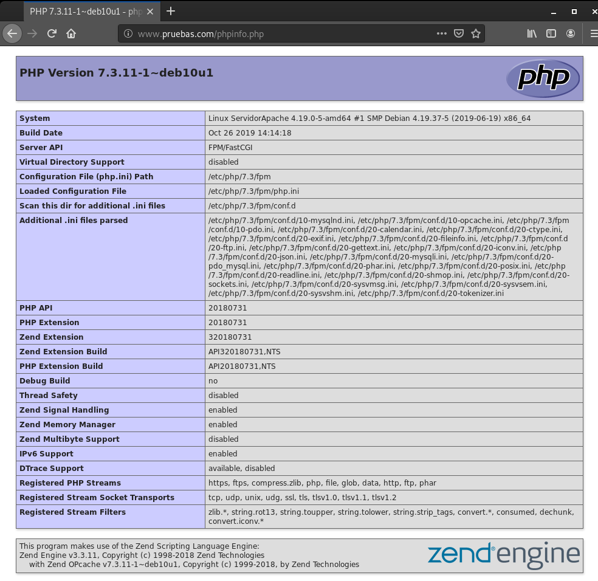
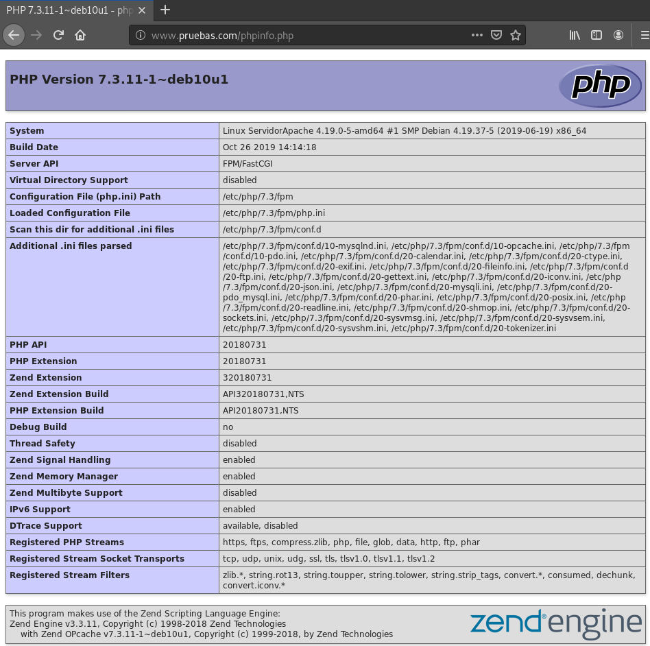
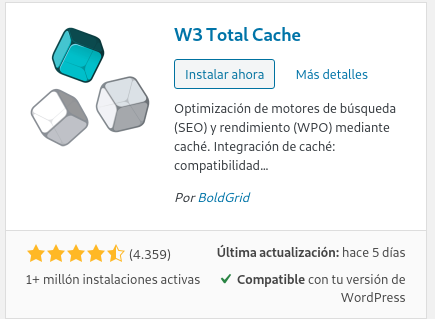
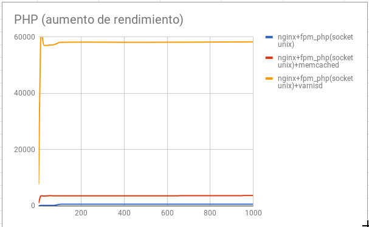

# Ejecución de scripts PHP y Python. Rendimiento

## Ejecución de scripts PHP

Vamos a comparar el rendimiento de distintas configuraciones de servidores web sirviendo páginas dinámicas programadas con PHP, en concreto vamos a servir un CMS Wordpress.

Las configuraciones que vamos a realizar son las siguientes:

* Módulo php5-apache2
* PHP-FPM (socket unix) + apache2
* PHP-FPM (socket TCP) + apache2
* PHP-FPM (socket unix) + nginx
* PHP-FPM (socket TCP) + nginx

## Tarea 1

* Realiza las configuraciones indicadas anteriormente y muestra una comprobación (con phpinfo()) donde se vea la configuración actual.

* Explica brevemente la modificación en los ficheros de configuración para cada una de las opciones.

* En cada una de las configuraciones debe funcionar el CMS WordPress.

* Cuando accedes a la biblioteca de medios de WordPress para subir una imagen, vemos que el tamaño máximo es 512Mb:

* Realiza varias pruebas (al menos 5) de rendimiento sobre cada configuración y quedáte con una media de las peticiones respondidas por segundo. ¿Qué configuración responde más peticiones por segundo?. Vamos a realizar pruebas con 200 peticiones concurrentes:

### Apache2 y mod_php
---------------------------------------------------------------------

#### Configuración



#### Instalación

###### Instalamos el paquete `php`

~~~
sudo apt install php
~~~

###### Instalamos el paquete `libapache2-mod-php`, que es el módulo de apache2
~~~
sudo apt-get install libapache2-mod-php
~~~

#### Cambio del tamaño de la biblioteca de medios



Modifica en la configuración de PHP en cada caso para aumentar el tamaño de los ficheros que podemos subir.

###### Modificamos la capacidad del post, en el fichero `/etc/php/7.3/apache2/php.ini`
~~~
post_max_size = 800M
~~~

###### Y ahora ya podemos subir el tamaño maximo, en el fichero `/etc/php/7.3/apache2/php.ini`

~~~
upload_max_filesize = 700M
~~~



#### Pruebas

###### Instalamos el paquete `apache2-utils` para realizar las pruebas de rendimientos y sacar la media
~~~
sudo apt install apache2-utils 
~~~

###### Realizamos la prueba cinco veces pero reiniciando apache cada una de ellas
~~~
ab -t 10 -c 200 -k http://172.22.7.242/index.php
~~~

###### Estos son los datos que salen
~~~
Requests per second:    49.97 [#/sec] (mean)
Requests per second:    75.69 [#/sec] (mean)
Requests per second:    84.21 [#/sec] (mean)
Requests per second:    81.54 [#/sec] (mean)
Requests per second:    72.83 [#/sec] (mean)
~~~

MEDIA: **75,85**

### Apache2 y PHP-FPM con socket unix
---------------------------------------------------------------------

#### Configuración



#### Instalación

###### Cambiamos los permisos del DocumentRoot
~~~
sudo chown -R www-data: /var/www/html/wordpress/
~~~

###### Instalamos los siguientes paquetes para PHP-FPM
~~~
sudo apt install php7.3-fpm php-common
~~~

###### Modificamos el fichero `/etc/php/7.3/fpm/pool.d/www.conf` y cambiamos el campo `listen` para tenerlo con socket unix  
~~~
listen = /run/php/php7.3-fpm.sock
~~~

###### Desactivamos el módulo php anteriormente instalado
~~~
sudo a2dismod php7.3
Module php7.3 disabled.
To activate the new configuration, you need to run:
  systemctl restart apache2
~~~

###### Activamos el módulo `setenvif`
~~~
sudo a2enmod proxy_fcgi setenvif
    Considering dependency proxy for proxy_fcgi:
    Enabling module proxy.
    Enabling module proxy_fcgi.
    Module setenvif already enabled
    To activate the new configuration, you need to run:
      systemctl restart apache2
~~~

###### Añadimos al Virtualhosts la configuración del PHP-FPM
~~~
<FilesMatch "\.php$">
    	SetHandler "proxy:unix:/run/php/php7.3-fpm.sock|fcgi://127.0.0.1/"
</FilesMatch>
~~~

###### Cambiamos del fichero `/etc/apache2/conf-available/php7.3-fpm.conf` para que utilice el socket unix en el campo `SetHandler`
~~~
SetHandler "proxy:unix:/run/php/php7.3-fpm.sock|fcgi://localhost"
~~~

###### Activamos la configuración
~~~
sudo a2enconf php7.3-fpm
    Enabling conf php7.3-fpm.
    To activate the new configuration, you need to run:
      systemctl reload apache2
~~~

###### Reiniciamos los servicios
~~~
sudo systemctl restart php7.3-fpm.service 
sudo systemctl restart apache2.service 
~~~

#### Cambio del tamaño de la biblioteca de medios



###### Para cambiar de 2MB a 700Mb vamos a modificar el fichero `/etc/php/7.3/fpm/php.ini` y cambiamos los parametros `upload_max_filesize` y `post_max_size` a `700`



#### Pruebas
###### Instalamos el paquete `apache2-utils` para realizar las pruebas de rendimientos y sacar la media
~~~
sudo apt install apache2-utils 
~~~

###### Realizamos la prueba cinco veces pero reiniciando apache cada una de ellas
~~~
ab -t 10 -c 200 -k http://172.22.7.242/index.php
~~~

###### Estos son los datos que salen
~~~
Requests per second:    145.28 [#/sec] (mean)
Requests per second:    132.85 [#/sec] (mean)
Requests per second:    135.56 [#/sec] (mean)
Requests per second:    133.76 [#/sec] (mean)
Requests per second:    137.46 [#/sec] (mean)
~~~

MEDIA: **136,99**

### Apache2 y PHP-FPM con socket TCP
---------------------------------------------------------------------

#### Configuración



#### Instalación

La instalación la realizaremos de la misma manera que en el punto anterior donde configurabamos _Apache2 con PHP-FPM con socket unix_ pero con algunas diferencias.

Las principales diferencias serían las siguientes:

* Hay que modificar el `listen` del fichero `/etc/php/7.3/fpm/pool.d/www.conf`.

~~~
listen = 127.0.0.1:9000
~~~

* Hay que modificar en el VirtualHost la linea del `ProxyPassMatch`

~~~
ProxyPassMatch ^/(.*\.php)$ fcgi://127.0.0.1:9000/var/www/html/wordpress
~~~

* Hay que modificar el `SetHandler` del fichero `/etc/apache2/conf-available/php7.3-fpm.conf`.
~~~
SetHandler "proxy:fcgi://127.0.0.1:9000"
~~~

###### Reiniciamos los servicios
~~~
sudo systemctl restart php7.3-fpm.service 
sudo systemctl restart apache2.service 
~~~

#### Cambio del tamaño de la biblioteca de medios

###### Para cambiar el tamaño vamos a modificar el fichero `/etc/php/7.3/fpm/php.ini` y cambiamos los parametros `upload_max_filesize` y `post_max_size` a `700`


#### Pruebas

###### Instalamos el paquete `apache2-utils` para realizar las pruebas de rendimientos y sacar la media
~~~
sudo apt install apache2-utils 
~~~

###### Realizamos la prueba cinco veces pero reiniciando apache cada una de ellas
~~~
ab -t 10 -c 200 -k http://172.22.7.242/index.php
~~~

###### Estos son los datos que salen
~~~
Requests per second:    128.78 [#/sec] (mean)
Requests per second:    126.06 [#/sec] (mean)
Requests per second:    137.11 [#/sec] (mean)
Requests per second:    129.38 [#/sec] (mean)
Requests per second:    135.11 [#/sec] (mean)
~~~

MEDIA: **131,29**

### Nginx y PHP-FPM con socket unix
---------------------------------------------------------------------

#### Configuración



#### Instalación

Para la instalación de nginx y su configuración, vamos a utilizar el virtualhost que viene por defecto al instalar nginx.

###### Instalamos nginx
~~~
sudo apt install nginx
~~~

Descomentamos el apartado del socket en el virtualhost por defecto, y dejamos comentado el del socket TCP.

###### El apartado sin modificar
~~~
#location ~ \.php$ {
#       include snippets/fastcgi-php.conf;
#
#       # With php-fpm (or other unix sockets):
#       fastcgi_pass unix:/run/php/php7.3-fpm.sock;
#       # With php-cgi (or other tcp sockets):
#       fastcgi_pass 127.0.0.1:9000;
#}
~~~

###### el apartado modificado
~~~
location ~ \.php$ {
       include snippets/fastcgi-php.conf;
#
#       # With php-fpm (or other unix sockets):
       fastcgi_pass unix:/run/php/php7.3-fpm.sock;
#       # With php-cgi (or other tcp sockets):
#       fastcgi_pass 127.0.0.1:9000;
}
~~~

###### Añadimos `phpinfo.php` para poder abrirlo.
~~~
index.php phpinfo.php
~~~

Modificamos en el fichero `/etc/php/7.3/fpm/pool.d/www.conf` las linea del listen para el socket unix. 
~~~
listen = /run/php/php7.3-fpm.sock
~~~

###### Reiniciamos los servicios
~~~
sudo systemctl restart php7.3-fpm.service 
sudo systemctl restart nginx.service 
~~~

#### Cambio del tamaño de la biblioteca de medios

###### Para cambiar el tamaño vamos a modificar el fichero `/etc/php/7.3/fpm/php.ini` y cambiamos los parametros `upload_max_filesize` y `post_max_size` a `700`



#### Pruebas

###### Instalamos el paquete `apache2-utils` para realizar las pruebas de rendimientos y sacar la media

~~~
sudo apt install apache2-utils 
~~~

###### Realizamos la prueba cinco veces pero reiniciando apache cada una de ellas

~~~
ab -t 10 -c 200 -k http://172.22.7.242/index.php
~~~

###### Estos son los datos que salen

~~~
Requests per second:    5720.35 [#/sec] (mean)
Requests per second:    5508.03 [#/sec] (mean)
Requests per second:    5532.09 [#/sec] (mean)
Requests per second:    5474.98 [#/sec] (mean)
Requests per second:    5791.26 [#/sec] (mean)
~~~

MEDIA: **5605,34**

### Nginx y PHP-FPM con socket TCP
---------------------------------------------------------------------

#### Configuración



#### Instalación

Para la configuración de nginx con socket TCP es igual que la anterior pero con algunos cambios.

* Modificamos el apartado del socket comentado el socket unix y descomentando el de TCP.
~~~
location ~ \.php$ {
        include snippets/fastcgi-php.conf;
#
#       # With php-fpm (or other unix sockets):
#       fastcgi_pass unix:/run/php/php7.3-fpm.sock;
#       # With php-cgi (or other tcp sockets):
        fastcgi_pass 127.0.0.1:9000;
}
~~~

* Modificamos el listen del fichero  `/etc/php/7.3/fpm/pool.d/www.conf` para que escuche en el socket TCP.
~~~
listen = 127.0.0.1:9000
~~~

#### Cambio del tamaño de la biblioteca de medios

###### Para cambiar el tamaño vamos a modificar el fichero `/etc/php/7.3/fpm/php.ini` y cambiamos los parametros `upload_max_filesize` y `post_max_size` a `700`


#### Pruebas

###### Instalamos el paquete `apache2-utils` para realizar las pruebas de rendimientos y sacar la media

~~~
sudo apt install apache2-utils 
~~~

###### Realizamos la prueba cinco veces pero reiniciando apache cada una de ellas

~~~
ab -t 10 -c 200 -k http://172.22.7.242/index.php
~~~

###### Estos son los datos que salen

~~~
Requests per second:    118.99 [#/sec] (mean)
Requests per second:    126.84 [#/sec] (mean)
Requests per second:    123.87 [#/sec] (mean)
Requests per second:    127.11 [#/sec] (mean)
Requests per second:    128.38 [#/sec] (mean)
~~~

MEDIA: **125,04**

## Rendimiento
Después de hacer varias pruebas de rendimiento con un número variable de peticiones concurrentes (1, 10, 25, 50, 75, 100, 250, 500, 1000). Los resultados obtenidos son los siguientes:



Podemos determinar que la opción que nos ofrece más rendimiento es nginx + fpm_php (socket unix).

A partir de esa configuración vamos a intentar aumentar el rendimiento de nuestro servidor.

## Aumento de rendimiento en la ejecución de scripts PHP

## Tarea 2 

Añade a la configuración ganadora del punto anterior memcached. Documenta la instalación y configuración memcached. Recuerda que para que Wordpress utilice memcached le tenemos que instalar un plugin. Muestra las estadísticas de memcached después de acceder varias veces a wordpress para comprobar que esa funcionando.

Instalamos el paquete `memcached` y `php-memcached`.

~~~
sudo apt install memcached php-memcached
~~~

Instalamos el plugin **W3 Total Cache**.

Activamos el plugin y reiniciamos los servicios de php-fpm, nginx y memcached

~~~
sudo systemctl restart memcached.service 
sudo systemctl restart php7.3-fpm.service 
sudo systemctl restart nginx.service
~~~

Podemos ver las Stats de memcaches conectarnos al puerto `11211` de memcached.

~~~
telnet localhost 11211
  Trying ::1...
  Trying 127.0.0.1...
  Connected to localhost.
  Escape character is '^]'.
stats
  STAT pid 30054
  STAT uptime 36
  STAT time 1580849484
  STAT version 1.5.6
  STAT libevent 2.1.8-stable
  STAT pointer_size 64
  STAT rusage_user 0.014770
  STAT rusage_system 0.007385
  STAT max_connections 1024
  STAT curr_connections 1
  STAT total_connections 2
  STAT rejected_connections 0
  STAT connection_structures 2
  STAT reserved_fds 20
  STAT cmd_get 0
  STAT cmd_set 0
  STAT cmd_flush 0
  STAT cmd_touch 0
  STAT get_hits 0
  STAT get_misses 0
  STAT get_expired 0
  STAT get_flushed 0
  STAT delete_misses 0
  STAT delete_hits 0
  STAT incr_misses 0
  STAT incr_hits 0
  STAT decr_misses 0
  STAT decr_hits 0
  STAT cas_misses 0
  STAT cas_hits 0
  STAT cas_badval 0
  STAT touch_hits 0
  STAT touch_misses 0
  STAT auth_cmds 0
  STAT auth_errors 0
  STAT bytes_read 7
  STAT bytes_written 0
  STAT limit_maxbytes 67108864
  STAT accepting_conns 1
  STAT listen_disabled_num 0
  STAT time_in_listen_disabled_us 0
  STAT threads 4
  STAT conn_yields 0
  STAT hash_power_level 16
  STAT hash_bytes 524288
  STAT hash_is_expanding 0
  STAT slab_reassign_rescues 0
  STAT slab_reassign_chunk_rescues 0
  STAT slab_reassign_evictions_nomem 0
  STAT slab_reassign_inline_reclaim 0
  STAT slab_reassign_busy_items 0
  STAT slab_reassign_busy_deletes 0
  STAT slab_reassign_running 0
  STAT slabs_moved 0
  STAT lru_crawler_running 0
  STAT lru_crawler_starts 255
  STAT lru_maintainer_juggles 86
  STAT malloc_fails 0
  STAT log_worker_dropped 0
  STAT log_worker_written 0
  STAT log_watcher_skipped 0
  STAT log_watcher_sent 0
  STAT bytes 0
  STAT curr_items 0
  STAT total_items 0
  STAT slab_global_page_pool 0
  STAT expired_unfetched 0
  STAT evicted_unfetched 0
  STAT evicted_active 0
  STAT evictions 0
  STAT reclaimed 0
  STAT crawler_reclaimed 0
  STAT crawler_items_checked 0
  STAT lrutail_reflocked 0
  STAT moves_to_cold 0
  STAT moves_to_warm 0
  STAT moves_within_lru 0
  STAT direct_reclaims 0
  STAT lru_bumps_dropped 0
  END
~~~

Realizamos las pruebas de rendimiento
~~~
ab -t 10 -c 200 -k www.pruebas.com/index.php
~~~

Estos son los datos obtenidos:
~~~
Requests per second:    4667.26 [#/sec] (mean)
Requests per second:    4760.42 [#/sec] (mean)
Requests per second:    4638.37 [#/sec] (mean)
Requests per second:    4925.24 [#/sec] (mean)
Requests per second:    4647.75 [#/sec] (mean)
Requests per second:    3854.64 [#/sec] (mean)
~~~

MEDIA: **5498,736**

## Tarea 3 

Configura un proxy inverso - caché Varnish escuchando en el puerto 80 y que se comunica con el servidor web por el puerto 8080. Entrega y muestra una comprobación de que varnish está funcionando con la nueva configuración.

Instalamos el paquete de `varnish`.
~~~
sudo apt install varnish
~~~

Modificamos el fichero `/etc/default/varnish`, para que escuche por el puerto 80.

Cambiamos esta configuración.
~~~
DAEMON_OPTS="-a :6081 \
             -T localhost:6082 \
             -f /etc/varnish/default.vcl \
             -S /etc/varnish/secret \
             -s malloc,256m"

~~~
Por esta otra.
~~~
DAEMON_OPTS="-a :80 \
             -T localhost:6082 \
             -f /etc/varnish/default.vcl \
             -S /etc/varnish/secret \
             -s malloc,256m"
~~~

También tenemos que modificar el fichero `/lib/systemd/system/varnish.service`.

Cambiamos esta configuración de `ExecStart`.

~~~
ExecStart=/usr/sbin/varnishd -j unix,user=vcache -F -a :6081 -T localhost:6082 -f /etc/varnish/default.vcl -S /etc/varnish/secret -s malloc,256m
~~~
Por esta otra.
~~~
ExecStart=/usr/sbin/varnishd -j unix,user=vcache -F -a :80 -T localhost:6082 -f /etc/varnish/default.vcl -S /etc/varnish/secret -s malloc,256m
~~~

Ahora vamos a configurar nginx, para que escuche por el puerto 8080. Para realizar esto, vamos a modificar el Virtualhost.

~~~
server {
    listen 8080;

    root /var/www/html/wordpress;

    # Add index.php to the list if you are using PHP
    index index.html index.php index.htm index.nginx-debian.html;
.
.
.
~~~

Reiniciamos los servicios

~~~
sudo systemctl restart nginx.service 
sudo systemctl restart php7.3-fpm.service 
sudo systemctl restart varnish.service 
~~~

Realizamos las pruebas de rendimiento
~~~
ab -t 10 -c 200 -k www.pruebas.com/index.php
~~~

Estos son los datos obtenidos:
~~~
Requests per second:    14778.87 [#/sec] (mean)
Requests per second:    14471.09 [#/sec] (mean)
Requests per second:    15490.85 [#/sec] (mean)
Requests per second:    14240.02 [#/sec] (mean)
Requests per second:    14276.58 [#/sec] (mean)
~~~

MEDIA: **14651,48**

### Rendimiento
Veamos las tres opciones que hemos configurado y veamos los resultados después del estudio de rendimiento:



Podemos observar como el uso de varnishd aumenta muy significativamente el rendimiento de nuestro servidor.