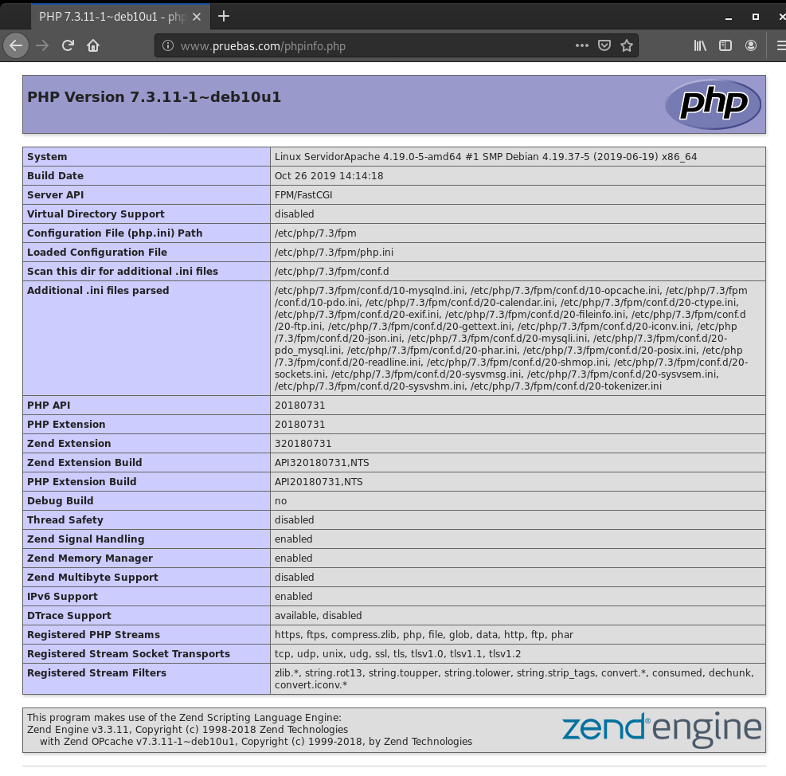

# Ejecución de scripts PHP y Python. Rendimiento

## Ejecución de scripts PHP

Vamos a comparar el rendimiento de distintas configuraciones de servidores web sirviendo páginas dinámicas programadas con PHP, en concreto vamos a servir un CMS Wordpress.

Las configuraciones que vamos a realizar son las siguientes:

* Módulo php5-apache2
* PHP-FPM (socket unix) + apache2
* PHP-FPM (socket TCP) + apache2
* PHP-FPM (socket unix) + nginx
* PHP-FPM (socket TCP) + nginx

## Tarea 1

* Realiza las configuraciones indicadas anteriormente y muestra una comprobación (con phpinfo()) donde se vea la configuración actual.

* Explica brevemente la modificación en los ficheros de configuración para cada una de las opciones.

* En cada una de las configuraciones debe funcionar el CMS WordPress.

* Cuando accedes a la biblioteca de medios de WordPress para subir una imagen, vemos que el tamaño máximo es 512Mb:

* Realiza varias pruebas (al menos 5) de rendimiento sobre cada configuración y quedáte con una media de las peticiones respondidas por segundo. ¿Qué configuración responde más peticiones por segundo?. Vamos a realizar pruebas con 200 peticiones concurrentes:

### Apache2 y mod_php
---------------------------------------------------------------------

#### Configuración



#### Instalación

###### Instalamos el paquete `php`

~~~
sudo apt install php
~~~

###### Instalamos el paquete `libapache2-mod-php`, que es el módulo de apache2
~~~
sudo apt-get install libapache2-mod-php
~~~

#### Cambio del tamaño de la biblioteca de medios



Modifica en la configuración de PHP en cada caso para aumentar el tamaño de los ficheros que podemos subir.

###### Modificamos la capacidad del post, en el fichero `/etc/php/7.3/apache2/php.ini`
~~~
post_max_size = 800M
~~~

###### Y ahora ya podemos subir el tamaño maximo, en el fichero `/etc/php/7.3/apache2/php.ini`

~~~
upload_max_filesize = 700M
~~~



#### Pruebas

###### Instalamos el paquete `apache2-utils` para realizar las pruebas de rendimientos y sacar la media
~~~
sudo apt install apache2-utils 
~~~

###### Realizamos la prueba cinco veces pero reiniciando apache cada una de ellas
~~~
ab -t 10 -c 200 -k http://172.22.7.242/index.php
~~~

###### Estos son los datos que salen
~~~
Requests per second:    49.97 [#/sec] (mean)
Requests per second:    75.69 [#/sec] (mean)
Requests per second:    84.21 [#/sec] (mean)
Requests per second:    81.54 [#/sec] (mean)
Requests per second:    72.83 [#/sec] (mean)
~~~

MEDIA: **75,85**

### Apache2 y PHP-FPM con socket unix
---------------------------------------------------------------------

#### Configuración



#### Instalación

###### Cambiamos los permisos del DocumentRoot
~~~
sudo chown -R www-data: /var/www/html/wordpress/
~~~

###### Instalamos los siguientes paquetes para PHP-FPM
~~~
sudo apt install php7.3-fpm php-common
~~~

###### Modificamos el fichero `/etc/php/7.3/fpm/pool.d/www.conf` y cambiamos el campo `listen` para tenerlo con socket unix  
~~~
listen = /run/php/php7.3-fpm.sock
~~~

###### Reiniciamos el servicio
~~~
sudo systemctl restart php7.3-fpm.service 
~~~

###### Desactivamos el módulo php anteriormente instalado
~~~
sudo a2dismod php7.3
Module php7.3 disabled.
To activate the new configuration, you need to run:
  systemctl restart apache2
~~~

###### Para enviar ficheros a los procesos de php para que este los interprete, instalamos el siguiente paquete
~~~
sudo apt install libfcgi0ldbl
~~~

###### Activamos el módulo `setenvif`
~~~
sudo a2enmod proxy_fcgi setenvif
    Considering dependency proxy for proxy_fcgi:
    Enabling module proxy.
    Enabling module proxy_fcgi.
    Module setenvif already enabled
    To activate the new configuration, you need to run:
      systemctl restart apache2
~~~

###### Añadimos al Virtualhosts la configuración del PHP-FPM
~~~
<FilesMatch "\.php$">
    	SetHandler "proxy:unix:/run/php/php7.3-fpm.sock|fcgi://127.0.0.1/"
</FilesMatch>
~~~

###### Cambiamos del fichero `/etc/apache2/conf-available/php7.3-fpm.conf` para que utilice el socket unix en el campo `SetHandler`
~~~
SetHandler "proxy:unix:/run/php/php7.3-fpm.sock|fcgi://localhost"
~~~

###### Activamos la configuración
~~~
sudo a2enconf php7.3-fpm
    Enabling conf php7.3-fpm.
    To activate the new configuration, you need to run:
      systemctl reload apache2
~~~

###### Reiniciamos el servicio
~~~
sudo systemctl restart php7.3-fpm.service 
~~~

#### Cambio del tamaño de la biblioteca de medios



###### Para cambiar de 2MB a 700Mb vamos a modificar el fichero `/etc/php/7.3/fpm/php.ini` y cambiamos los parametros `upload_max_filesize` y `post_max_size` a `700`



#### Pruebas
###### Instalamos el paquete `apache2-utils` para realizar las pruebas de rendimientos y sacar la media
~~~
sudo apt install apache2-utils 
~~~

###### Realizamos la prueba cinco veces pero reiniciando apache cada una de ellas
~~~
ab -t 10 -c 200 -k http://172.22.7.242/index.php
~~~

###### Estos son los datos que salen
~~~
Requests per second:    145.28 [#/sec] (mean)
Requests per second:    132.85 [#/sec] (mean)
Requests per second:    135.56 [#/sec] (mean)
Requests per second:    133.76 [#/sec] (mean)
Requests per second:    137.46 [#/sec] (mean)
~~~

MEDIA: **136,99**

### Apache2 y PHP-FPM con socket TCP
---------------------------------------------------------------------

#### Configuración



#### Instalación

#### Cambio del tamaño de la biblioteca de medios





#### Pruebas
~~~
sudo apt install apache2-utils 
~~~

~~~
ab -t 10 -c 200 -k http://172.22.7.242/index.php
~~~

### Nginx y PHP-FPM con socket unix
---------------------------------------------------------------------

#### Configuración



#### Instalación

#### Cambio del tamaño de la biblioteca de medios





#### Pruebas
~~~
sudo apt install apache2-utils 
~~~

~~~
ab -t 10 -c 200 -k http://172.22.7.242/index.php
~~~

### Nginx y PHP-FPM con socket TCP
---------------------------------------------------------------------

#### Configuración



#### Instalación

#### Cambio del tamaño de la biblioteca de medios





#### Pruebas
~~~
sudo apt install apache2-utils 
~~~

~~~
ab -t 10 -c 200 -k http://172.22.7.242/index.php
~~~

#### Rendimiento
Después de hacer varias pruebas de rendimiento con un número variable de peticiones concurrentes (1, 10, 25, 50, 75, 100, 250, 500, 1000). Los resultados obtenidos son los siguientes:



Podemos determinar que la opción que nos ofrece más rendimiento es nginx + fpm_php (socket unix).

A partir de esa configuración vamos a intentar aumentar el rendimiento de nuestro servidor.

## Aumento de rendimiento en la ejecución de scripts PHP

## Tarea 2 

Añade a la configuración ganadora del punto anterior memcached. Documenta la instalación y configuración memcached. Recuerda que para que Wordpress utilice memcached le tenemos que instalar un plugin. Muestra las estadísticas de memcached después de acceder varias veces a wordpress para comprobar que esa funcionando.

## Tarea 3 

Configura un proxy inverso - caché Varnish escuchando en el puerto 80 y que se comunica con el servidor web por el puerto 8080. Entrega y muestra una comprobación de que varnish está funcionando con la nueva configuración.

#### Rendimiento
Veamos las tres opciones que hemos configurado y veamos los resultados después del estudio de rendimiento:



Podemos observar como el uso de varnishd aumenta muy significativamente el rendimiento de nuestro servidor.

## Ejecución de scripts Python

Vamos a comparar el rendimiento de distintas configuraciones de servidores web sirviendo páginas dinámicas programadas con Python, en concreto vamos a servir un CMS Mezzanine (Instala algunas páginas de demostración durante la instalación: `Would you like to install some initial demo pages?`).

Las configuraciones que vamos a realizar son las siguientes:

* apache2 + Módulo wsgi
* apache2 + gunicorn
* apache2 + uwsgi
* nginx + gunicorn
* nginx + uwsgi

### Tarea 4 

Documenta la instalación y configuración para cada una de las configuraciones propuestas en el ejercicio. En cada una de las configuraciones debe ejecutarse un CMS python, por ejemplo, Mezzanine.

#### Rendimiento



Podemos observar que la opción que más rendimiento ofrece es nginx + uwsgi.